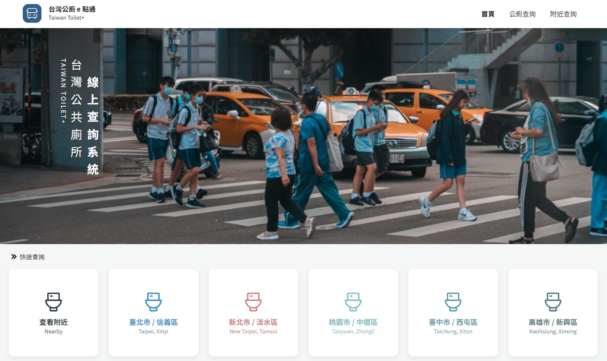
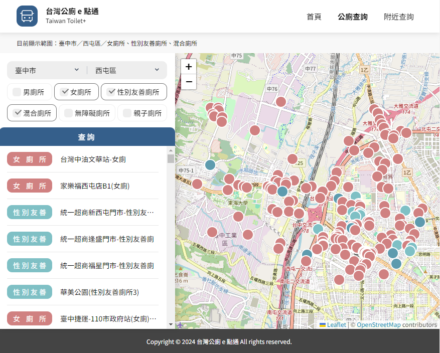
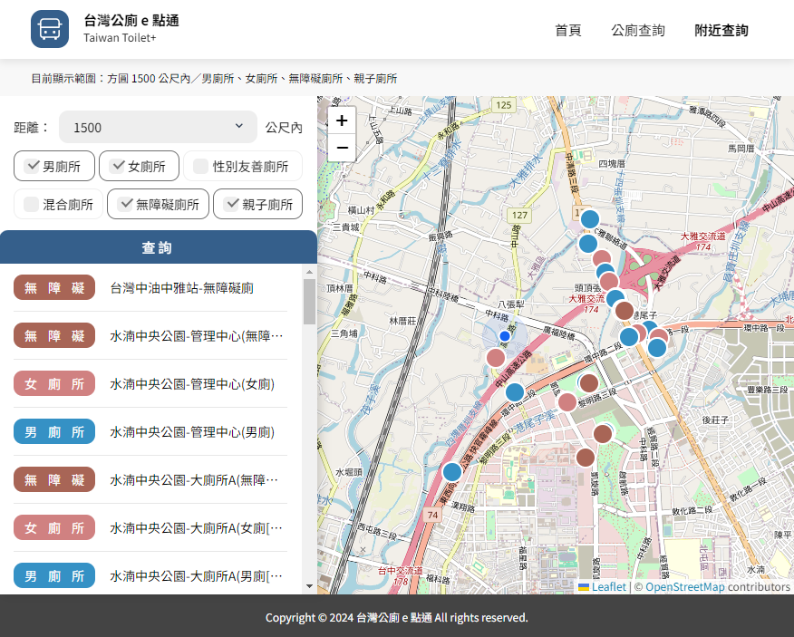
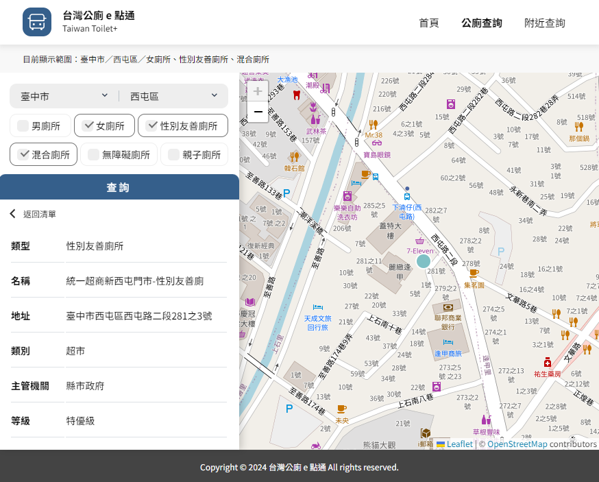

# 台灣公共廁所查詢系統

[UI 設計：鹽酥G](https://2021.thef2e.com/users/6296432819610583727/) | [設計稿](https://www.figma.com/file/JTb1ArUXnSceYEt6DmCGib/Week3---%E5%85%A8%E5%8F%B0%E5%85%AC%E8%BB%8A%E5%8B%95%E6%85%8B%E6%99%82%E5%88%BB%E6%9F%A5%E8%A9%A2%E6%87%89%E7%94%A8%E6%9C%8D%E5%8B%99?node-id=25%3A3) | [Demo](https://taiwan-toilet-finder.vercel.app/)

使用環境部開放資料 API 製作的全台公廁查詢系統

## 使用技術
- React
- React-Leaflet
- Leaflet
- Styled-Components
- Geolib
- Vercel

## 作品說明
### 依據地區、廁所類型篩選查詢結果
</img>

### 依據定位查詢方圓 300～2000 公尺內指定類型廁所
</img>

### 點擊清單或者地圖標記，可自動定位至該地，並瀏覽詳細資料
</img>

## 相關連結
[環境部全國公廁建檔資料](https://data.moenv.gov.tw/dataset/detail/FAC_P_07)